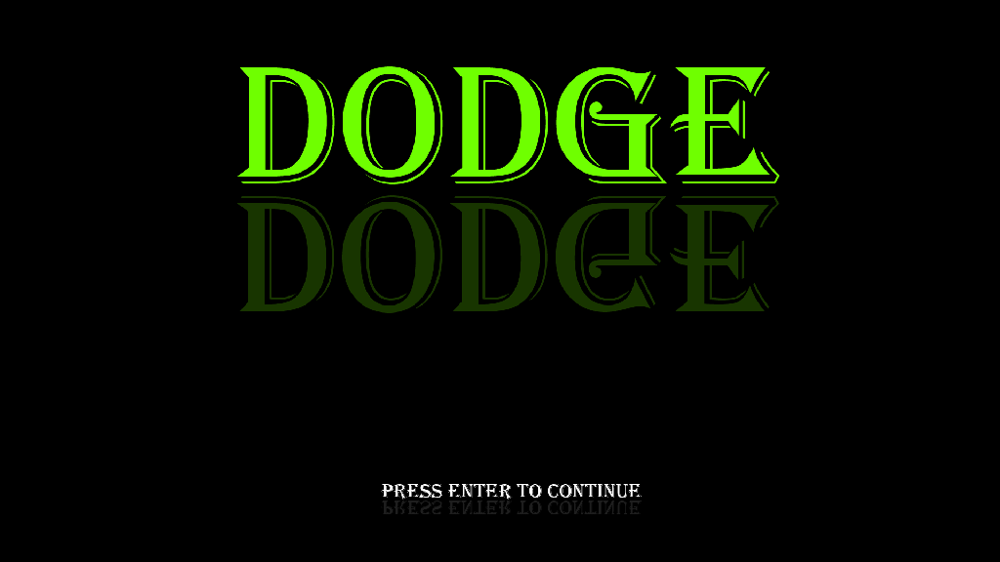

# Dodge (May 2014)
Project for 12th grade exam made with C++ with SFML. Rebuilt in August 2019 with SFML 2.5.1.

Dodge enemies and collect points. Survival style game.

## Project Description
The project is a survival type game. The player is represented by a green circle and must collect teal circles to increase points while avoiding enemies marked by yellow, orange and red circles which bounce around the arena. The goal is to get a high score.

## Usage

* With mouse click over buttons (Play, Credits, Exit)
* With arrows keys or WASD control the player
* Hold Spacebar down to slow down the player (for more precise movements)
